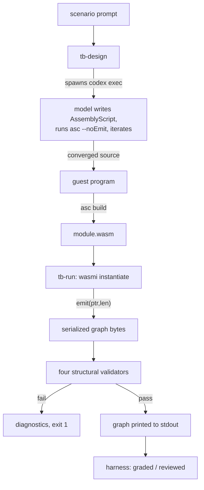

# ThreadBox

ThreadBox turns a natural-language description of a repetitive task into a
**reviewable, replayable plan**, and keeps producing the plan strictly separate
from running it.

The plan is a directed acyclic graph — an intermediate representation, the IR.
It is produced by compiling a small AssemblyScript program to WebAssembly and
running that module in a memory-capped sandbox, where its only permitted effect
is to serialize the graph it built. **Nothing in the graph executes while the
graph is being produced.** Executing the graph is a later, separate concern and
is not part of this repository yet.

## The motivating problem

A caseworker submission arrives as JSON. It must be keyed into a legacy grants
application that has no API, is only reachable over a VPN, and whose HTML is
pathological. This happens hundreds of times a year.

A browser-extension agent that rediscovers the form layout on every run pays for
that reasoning on every run. ThreadBox does the reasoning once, in the design
loop, and produces a plan that can be replayed cheaply — after a human or a
panel of models has read it.

## Three artifacts, one boundary

| Artifact | Where | What it does |
|---|---|---|
| The DSL | `guest/assembly/` | AssemblyScript library. Its only purpose is to build the graph in the guest's own linear memory. |
| `tb-design` | `rust/design/` | Drives a model until the AssemblyScript it writes type-checks, logging every attempt. |
| `tb-run` | `rust/runner/` | Instantiates the compiled module under `wasmi`, captures the emitted graph, validates it structurally, prints it. |

Exactly one function crosses from guest to host:

| Module | Function | Parameters | Returns |
|---|---|---|---|
| `threadbox.ir.v1` | `emit` | `ptr: usize, len: i32` | `void` |

The guest calls it once, at the end of `main`. The host reads `len` bytes from
guest linear memory and the guest is finished. No handles cross the boundary, no
callbacks cross the boundary, and the host offers no clock, randomness,
filesystem, or network.

Because the vocabulary of combinators lives entirely in a guest library rather
than in the import table, adding a combinator is a library change and not a
versioned ABI migration. Any change to the row above is breaking and takes a
version bump in the module name, never an in-place edit.

## Flow



Compiling successfully earns a program the right to be inspected, nothing more.
A graph that fails any validator is not run. A graph that passes is *eligible*
to be reviewed, which is a separate judgement.

## Layout

```
threadbox/
  README.md   this file
  AGENTS.md   conventions and verification commands
  DSL.md      the language: every construct, worked example
  IR.md       the graph: node schema, serialized form, validators
  guest/      AssemblyScript library, examples, golden tests
  rust/       standalone Cargo workspace: threadbox-ir, tb-design, tb-run
  harness/    catalogs, policy, provider adapters, graders, scenarios
  skills/     the instruction file fed to the design loop
```

Two package manifests exist deliberately. `guest/package.json` pins the compiler
that decides *is this valid AssemblyScript*; `harness/package.json` pins the
tooling that decides *how do we run the evaluation matrix*. They move on
different schedules and must not pin each other.

`rust/` is a standalone workspace, not a member of `codex-rs`. It must stay
extractable: copying the directory elsewhere and running `cargo test` has to
work with no edits.

## Running it

```sh
# type-check every guest source
cd guest && npx asc assembly/ir.ts --noEmit

# produce and validate a graph from the reference program
cargo run --manifest-path rust/Cargo.toml --bin tb-run -- guest/examples/grants-entry.ts

# drive a model until its AssemblyScript type-checks
cargo run --manifest-path rust/Cargo.toml --bin tb-design -- --scenario grants-entry

# the evaluation matrix
cd harness && npm test
```

## Model selection

A program never names a concrete model in an operational sense. It states
intent — a tier, or an explicit subset of vendor, model, reasoning effort,
context window, and driver — and the record it produces is inert. Resolution
happens outside the guest against two files with different owners:

| File | Owner | Answers |
|---|---|---|
| `harness/catalogs/<driver>.yaml` | driver author | what does this driver currently serve? |
| `harness/policy.yaml` | operator | which logical tier and role maps to which catalog entry? |

Roles are `plan`, `code`, `review`, `summarize`. Tiers are `eco`, `balanced`,
`performance`. Resolution precedence, highest first: a forced single model, a
per-role override, a selected tier, the policy default tier. Unknown, disabled,
incompatible, or over-budget selections fail before any network call — including
when forced. Generated code cannot alter this.

Retiring a model is therefore a catalog edit and never a change to any program.

## Agent chaining and data reshaping

The twelve original node kinds describe vision-driven browser automation.
Two additional kinds extend the vocabulary to agent-to-agent pipelines — model
calls that produce text or structured data, and host-evaluated structural
queries that reshape it — without altering the DAG contract, the single
`Publish` terminal, or the zero-dependency Rust reader.

| Kind | Purpose |
|---|---|
| `Prompt` | Send a prompt (literal text or a named template key) to a model and receive text or JSON. |
| `Transform` | Reshape data with a host-evaluated jq/xq expression. Never guest-computed. |

**Prompt templates** follow the same discriminator pattern as `Type`'s
`valueKind`. A `promptKind: "literal"` node carries the template text directly
in the graph. A `promptKind: "name"` node carries a logical key that the host
resolves against operator-owned configuration at execution time — exactly as
`LoadJson`'s `name` field resolves a named document. No literal path, URL, or
credential ever appears in the graph.

**Model call chaining** uses the same cursor idiom as the rest of the DSL. A
call returns a `Step` whose output is declared to be text or JSON via a
mandatory finalizer; downstream nodes reference that `Step` as a parent,
exactly as they reference a `LoadJson` or a `Locate`.

**Data reshaping** is always host-side. A jq/xq expression is recorded as an
opaque string in a `Transform` node. The host evaluates it at execution time.
The guest never parses, composes, or inspects jq expressions.

**Bounded iteration over model output** reuses the existing `ForEach` node.
When a `ForEach`'s source is a `Prompt` returning JSON, or a `Transform`, the
body subgraph runs once per element of the output array. Boundedness is
guaranteed by the finite length of the model output and, for the
flatMap-equivalent reshape, by a required literal element-count bound.

These constructs compose with `Retry` and `Fallback` for bounded repetition
and escalation, exactly as `Locate` and `Verify` do today. See `DSL.md` and
`IR.md` for the full vocabulary, node schema, and worked example.

The "no arithmetic, no string manipulation, no comparison operators on
document values" rule remains in force for everything the guest controls.
Template placeholder substitution and jq evaluation both happen host-side.
The guest describes *what* to compute, not *how* to compute it. The graph is
still a plan, still acyclic, and still terminates by structural inspection.

## Not in scope here

Executing the graph. Any encoding beyond the one documented serialized form.
Wiring real vision or audio transports. Reading a serialized graph back into a
runnable structure. Persistence, scheduling, or a daemon. Any change to
`codex-rs`.
